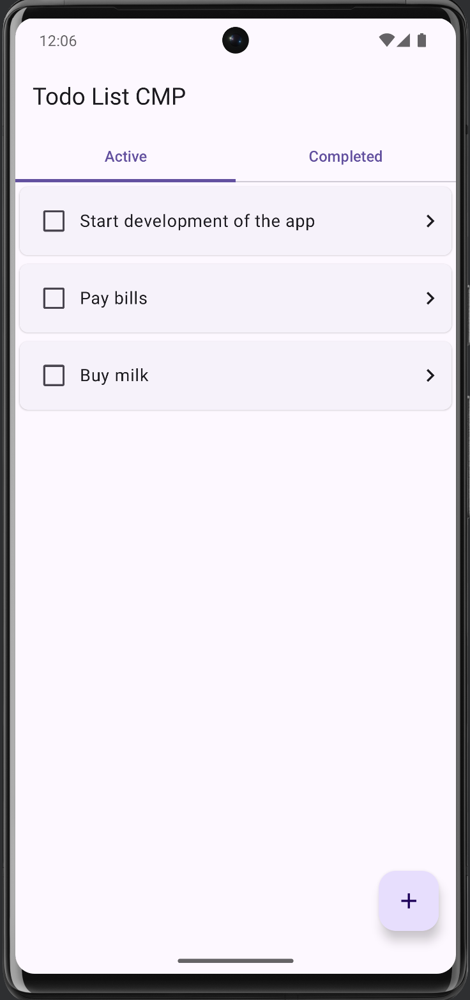
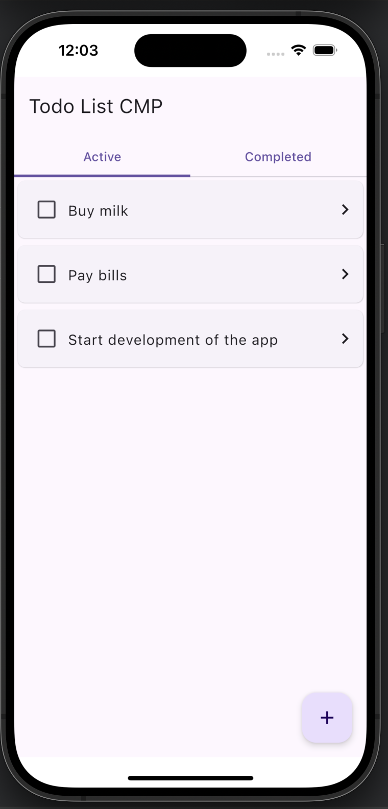
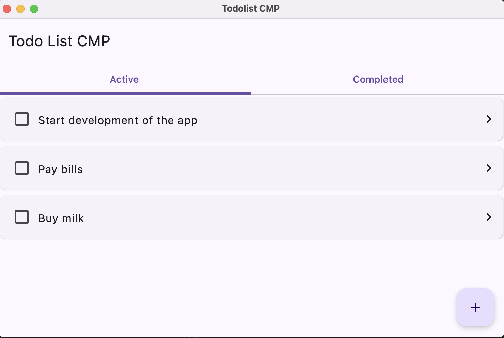

## General Info

A Kotlin Multiplatform demo project targeting Android, iOS and Desktop using Compose Multiplatform as the common ui.

Please visit https://github.com/zaferertas/todolist for the same app that is developed using native UI libraries: Jetpack Compose for Android and SwiftUI for IOS.

## Architecture
The app is shared between Android, iOS and Desktop. The shared code is written in Kotlin and the UI is built with Compose Multiplatform. Shared code, written in Kotlin, is compiled to JVM bytecode for Android and Desktop with Kotlin/JVM and to native binaries for iOS with Kotlin/Native.

## Run project
### Android
To run the application on android device/emulator:
- open project in Android Studio and run imported android run configuration

### Desktop
Run the desktop application: `./gradlew :desktop:run`

### iOS
To run the application on iPhone device/simulator:
- Open `ios/iosApp.xcworkspace` in Xcode and run standard configuration
- Or use [Kotlin Multiplatform Mobile plugin](https://plugins.jetbrains.com/plugin/14936-kotlin-multiplatform-mobile) for Android Studio

## Screenshots
### Android

### iOS

### Desktop

## Libraries used
- 🧩 [Compose Multiplatform](https://github.com/JetBrains/compose-multiplatform); for shared UI
- 🔷 [kotlinx.coroutines](https://github.com/Kotlin/kotlinx.coroutines) - Library support for Kotlin coroutines with multiplatform support
- 📦 [Kotlinx Serialization](https://github.com/Kotlin/kotlinx.serialization); for content negotiation
- 🕰️ [Kotlinx Datetime](https://github.com/Kotlin/kotlinx-datetime); for datetime
- 🗄 [SQLDelight](https://github.com/cashapp/sqldelight) - for the sqlite database
- ⧉  [Koin](https://insert-koin.io/) - For dependency injection
- 🔶 [Kermit](https://kermit.touchlab.co/) - For logging
- 
## Related Resources

- [Kotlin Multiplatform](https://kotlinlang.org/docs/multiplatform-get-started.html)
- [Get started with Kotlin Multiplatform](https://www.jetbrains.com/help/kotlin-multiplatform-dev/get-started.html)
- [Using Koin in a Kotlin Multiplatform Project](https://johnoreilly.dev/posts/kotlinmultiplatform-koin/)
- [Kotlin Multiplatform samples](https://www.jetbrains.com/help/kotlin-multiplatform-dev/multiplatform-samples.html)
